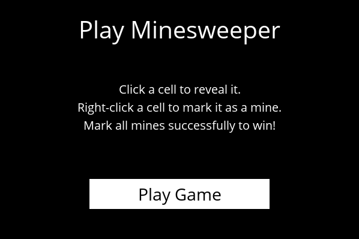
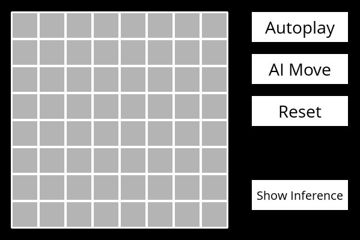
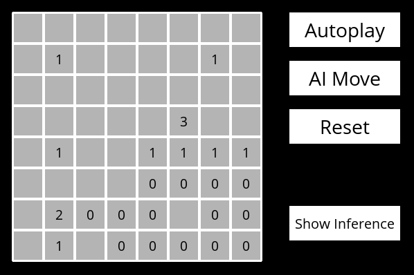
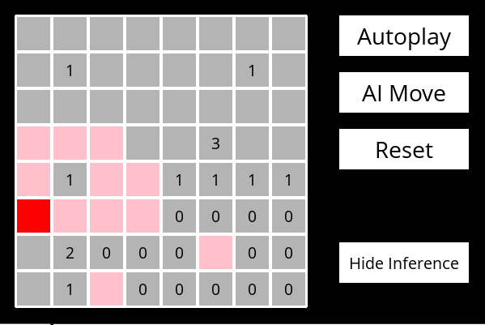

# Minesweeper
### Harvard CS50's Introduction to Artificial Intelligence with Python (Project 1)

Minesweeper game powered with an AI assistant to help you dodge all those dangerous mines!

## Description
In this project, **Artificial Intelligence** assistant is integrated in the famous **Minesweeper** game. So, it provides a lot of cool features like allowing the AI to play the whole game or just make a single move. 
This is done by using **Propositional Logic** and **Inference Rules** to deduce whether a cell is *safe* or not. As the game goes on, more knowledge is collected with each move and the AI tries to deduce the *status* of cells. 
For example, if we know that a cell has **0** mines around it, we can mark all the cells around it (one step away) as **safe**. Similarly, if we know that a cell has **1** mine around it and there is only one unrevelead cell next to it, we can mark the unrevealed cell as **mine**. These are just basic examples of the inference rules used in this project.

## Features
Other than the basic gameplay, this project offers the following features as well:
- **AI Move:** If you are not sure about your next move, let the AI do it for you. The AI assistant will make the *best* move possible. Note, that it might select a mine cell because of lack of knowledge resulting in a lost game.
- **Autoplay:** This feature allows you to sit back and watch the AI play for itself. It will start from making random moves and then choose safe moves as more and more knowledge is accumulated.
- **Show Inference:** You can easily visualize the inferences made by the AI! It will color the cells that are confirmed as either *safe* (PINK) or *mine* (RED) so that you can *stay safe*!

## Screenshots

Autoplay with Inference Shown <strong>(GIF - 25 seconds)</strong>

    

Main Menu

    

Start Screen

    

Gameplay with Inference Hidden

    

Gameplay with Inference Shown

    

